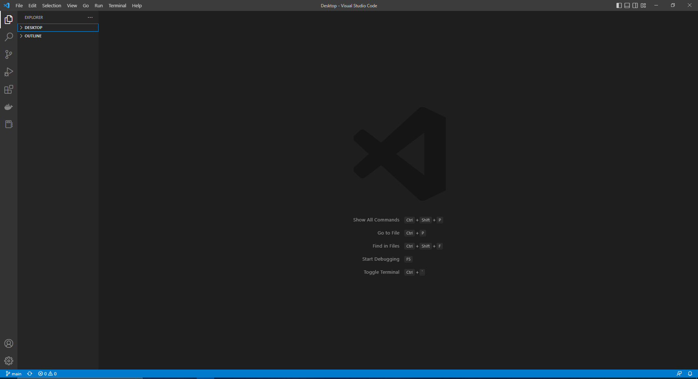
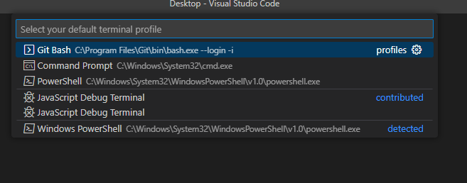
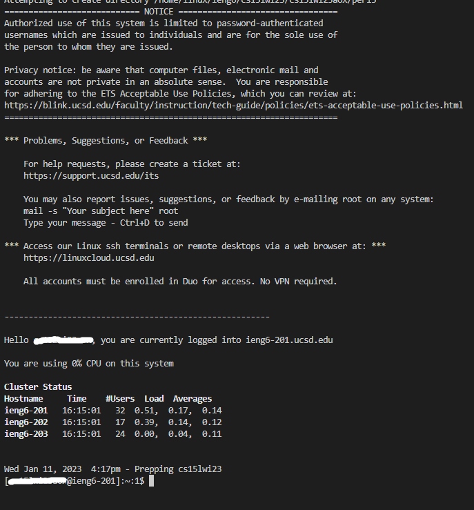
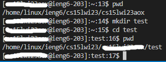

## Connor Wu - Week 1 Lab Report: Remote Access Tutorial

This tutorial will explain the process of setting up VSCode and git bash to be able to remotely access the **ieng6** server using your unique student account.

### Step 1: Download Visual Studio Code

Start by downloading [Visual Studio Code](https://code.visualstudio.com/) for your respective operating system and follow the setup instructions.
It should look something like this upon opening the software:

### Step 2: Download Git

Download and install [Git For Windows](https://gitforwindows.org/)
This will be used to access Git Bash, which contains useful command-line tools for git repositories and remote access.

### Step 3: Configure Git Bash in VSCode

1. Open the command palette in VSCode using Ctrl+Shift+P
2. Type `Terminal: Set Default Profile`
3. From the drop-down menu, select Git Bash:
   
4. Open the Terminal: Terminal --> New Terminal or Ctrl+`

### Step 4: SSH into the server

1. Use this command but with your specific username to access the remote server:
   `$ ssh cs15lwi23zz@ieng6.ucsd.edu`
   (Upon your first login, it will state that "the authenticity of the host can't be established." This is normal, just type "yes" to continue.)
2. Enter your password that you set by following [this tutorial](https://docs.google.com/document/d/1hs7CyQeh-MdUfM9uv99i8tqfneos6Y8bDU0uhn1wqho/edit).
3. You will be greeted by this screen upon your first login:
   

### Step 5: Try Some Commands

Here are some useful commands to try in the terminal:

1. `$ cd ~`: Change to home directory
2. `$ cd [directory]`: Move into a subdirectory
3. `$ ls -lat`: lists all files sorted by time
4. `$ ls -a` : lists all files
5. `$ pwd`: prints the current directory
6. `$ mkdir <directory>`: creates a new folder in the current directory

Example:

Here I have used `$ pwd` to print my current directory. Then, I used `$ mkdir test` to create a new folder called test. After entering the test folder using `cd test`, using `$ pwd` shows the new current directory inside test.
