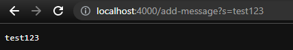
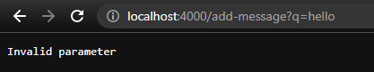

## Connor Wu - Week 3 Lab Report

This report will demonstrate the creation of a webserver called StringServer,
and explains a bug found during lab 3.

---

## Part 1: StringServer

I created a file called StringServer.java containing a handler class and a StringServer class that initiates the server. The backend is implemented using the same Server.java file provided during lab.

StringServer.java:

```
import java.io.IOException;
import java.net.URI;

class Handler implements URLHandler {
    String sequence = "";

    @Override
    public String handleRequest(URI url) {
        if (url.getPath().contains("/add-message")) {
            String[] parameters = url.getQuery().split("=");
            if (parameters[0].equals("s")) {
                sequence = sequence + parameters[1] + "\n";
            } else {
                return "Invalid parameter";
            }
            return sequence;
        } else {
            return "404 Not Found!";
        }
    }
}

class StringServer {
    public static void main(String[] args) throws IOException {
        if (args.length == 0) {
            System.out.println("Missing port number! Try any number between 1024 to 49151");
            return;
        }

        int port = Integer.parseInt(args[0]);

        Server.start(port, new Handler());
    }
}
```

---

### Regular input


Method(s) called: handleRequest

Relevant args: url = http://localhost:4000/add-message?s=test123

Affected values: sequence is set from "" to "test123\n".

### Incorrect input


Method(s) called: handleRequest

Relevant args: url = http://localhost:4000/add-message?q=test123

Affected values: sequence is unchanged, because the parameter name is 'q' instead of 's'.

---

## Part 2: Bug from Lab 3

When reverseInPlace is passed an array that contains multiple different values, it does not produce the correct output:
```
  @Test
  public void testReverseInPlace2() {
    int[] input1 = { 1, 2, 3 };
    ArrayExamples.reverseInPlace(input1);
    assertArrayEquals(new int[] { 3, 2, 1 }, input1);
  }
```

However, it produces the expected output when passed an array with all the same values:
```
  @Test
  public void testReverseInPlace3() {
    int[] input1 = { 1, 1, 1, 1, 1, 1 };
    ArrayExamples.reverseInPlace(input1);
    assertArrayEquals(new int[] { 1, 1, 1, 1, 1, 1 }, input1);
  }
```
