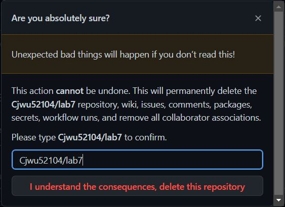
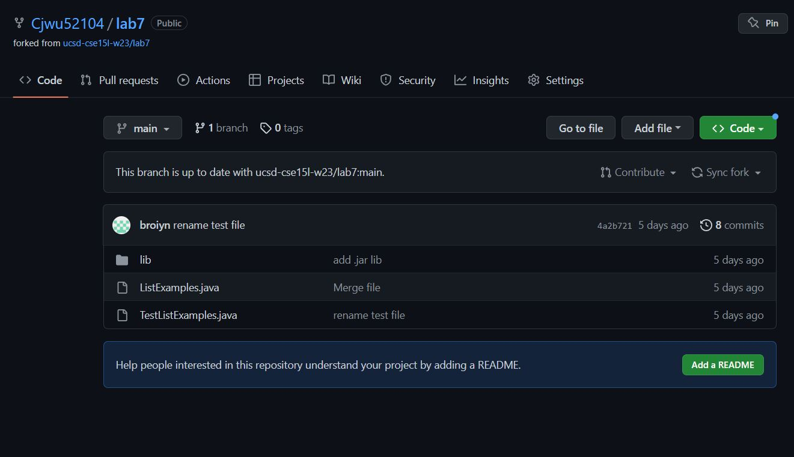
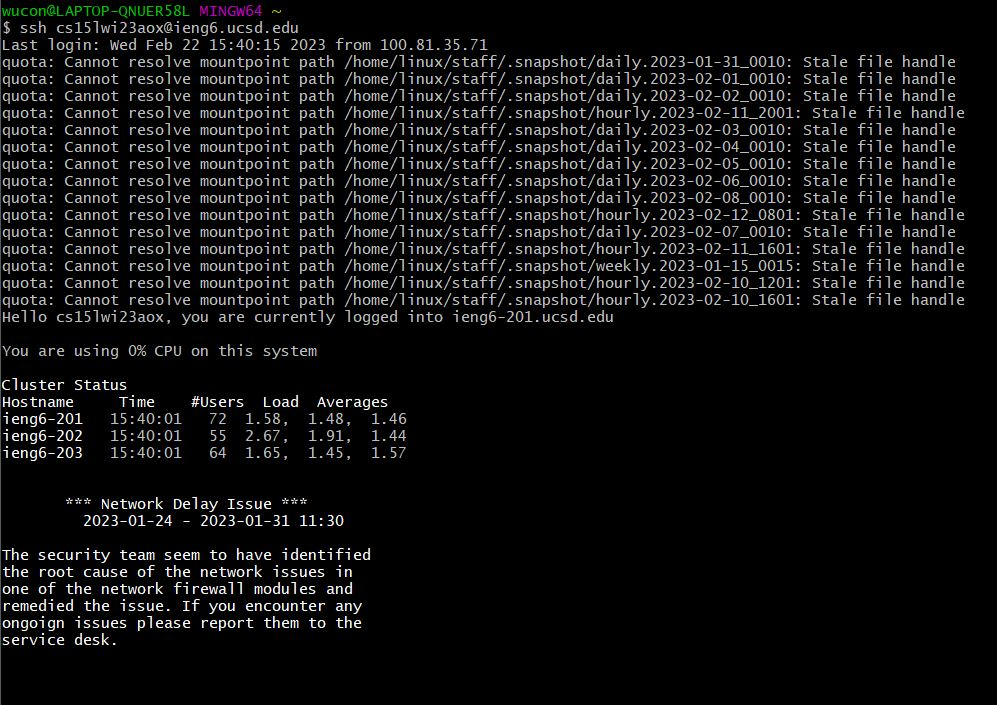
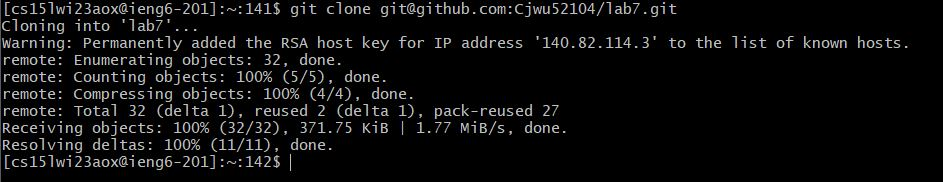
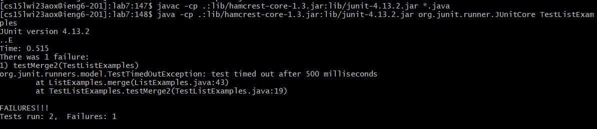
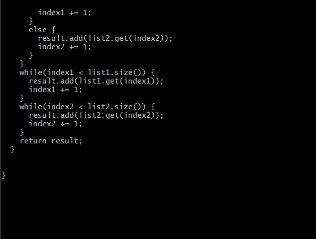
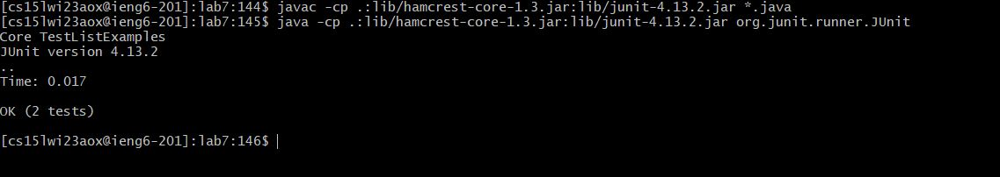
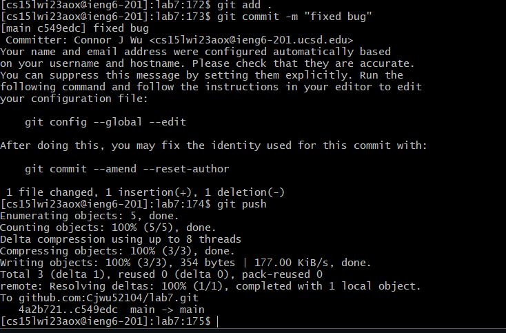
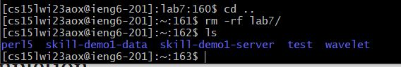

### Lab Report 4 - Connor Wu

1.) Delete fork

Cjwu52104/lab7

2.) Fork repo

https://github.com/ucsd-cse15l-w23/lab7

Fork > Create Fork

3.) Login with SSH

Keystrokes: `<ctrl>+r ssh <enter>`

4.) Clone
  

Keystrokes: `<ctrl>+r cl <enter>`

5.) Compile Tests + Run

Keystrokes: `cd l<tab>, <ctrl>+r javac <enter>, <ctrl>+r ru <enter>`

6.) Fix Error

Keystrokes: `nano L<tab><enter>` then `<ctrl>+w return result <enter>, <ctrl>+w <enter><up><up><right(8x)><backspace>2, <ctrl>+o <enter> <ctrl>+x`

7.) Rerun tests

Keystrokes: `<ctrl>+r javac <enter> <ctrl>+r ru <enter>`

8.) Commit changes

Keystrokes: `git add . <enter>, git commit -m "fixed bug", git push`

9.) Delete repo on ieng6

Keystrokes: `cd .., rm -rf l<tab> <enter>, ls`

### Shortcut References

`<ctrl>+r` is used to search previous commands, meaning that once you type a command out the first time, you can search for it with a few characters the second time and simply press enter to save time.

`<tab>` autofills the command/word you're typing if it's easily recognized by bash. For example, I did `nano L<tab> <enter>` in step 6 because there was only one file that started with L, so pressing tab completed the name of the file, ListExamples.java.

`<ctrl> + o` and `<ctrl> + x` save and exit a file (respectively) after editing it in nano. This makes it easy to edit files from the command lines, and to switch between editing and running commands, or perhaps another file.

